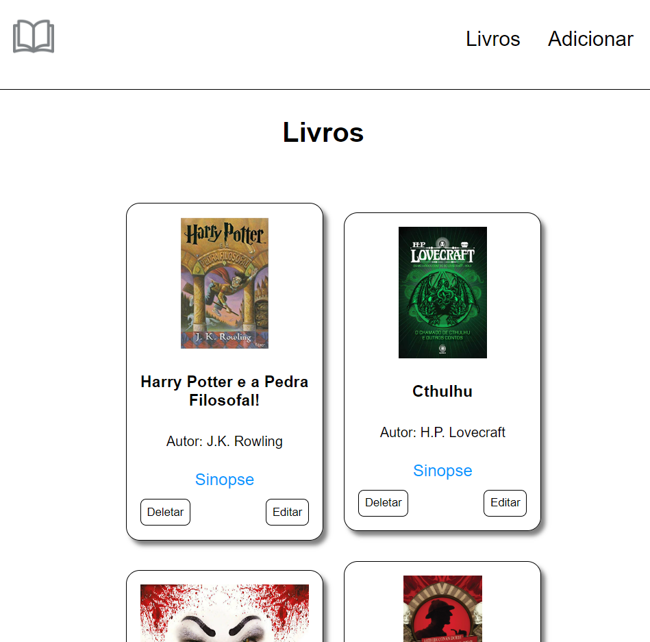

# Livros Nodejs
# Sobre
<p>Projeto feito em Nodejs para testar o uso do MongoDB e do Mongoose</p>
<p>Se trata de um projeto feito para utilizar o CRUD com mongoose, sendo meu primeiro CRUD feito em Nodejs integrando com um banco de dados. Você tem as opções de criar um livro, com título, imagem e descrição, que ficará visível na página principal, além das opções de excluir ou deletar um livro. </p>
<p>Para contruir as telas deste projeto foi utilizado um template do Nodejs, o Hnadlebars</p>

# Telas do projeto
<div float="left">
    
    
    <br />
    
    
</div>

# Tecnologias utilizadas
## Back end
- Nodejs
- MongoDB
- Mongoose

## Front end
- Handlebars

# Execução
    ```bash
    # clonar o projeto
    git clone https://github.com/diegocruz-s/booksnodejs

    # ir para o diretório
    cd booksnodejs

    # instalar dependências
    npm install

    # rodar projeto
    npm start

    Acesse a rota /books para ver o conteúdo
    ```

# Autor
<p>Diego Cruz's</p>
<a href="https://www.linkedin.com/in/diego-cruz-56436b248/">https://www.linkedin.com/in/diego-cruz-56436b248/</a>


<!-- npm install -->
<!-- npm start -->